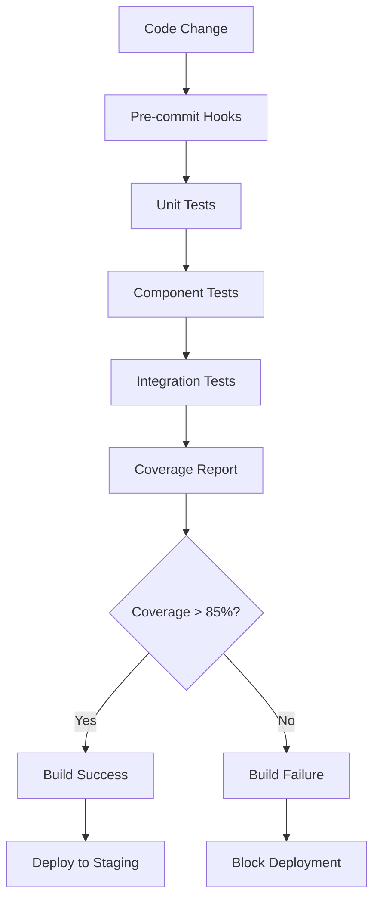

# Design Document

## Overview

This design document outlines the comprehensive testing strategy for the Pot2Pump application, focusing on unit tests, integration tests, and component tests. The design ensures reliable testing of critical financial operations, blockchain interactions, and user interface components while maintaining fast test execution and clear feedback.

## Architecture

### Testing Framework Stack

```
┌─────────────────────────────────────────────────────────────┐
│                    Test Execution Layer                     │
├─────────────────────────────────────────────────────────────┤
│  Jest (Test Runner) + Vitest (Fast Unit Tests)             │
├─────────────────────────────────────────────────────────────┤
│                   Component Testing                         │
├─────────────────────────────────────────────────────────────┤
│  React Testing Library + @testing-library/jest-dom         │
├─────────────────────────────────────────────────────────────┤
│                   Mocking & Utilities                       │
├─────────────────────────────────────────────────────────────┤
│  MSW (API Mocking) + Wagmi Test Utils + Custom Mocks       │
├─────────────────────────────────────────────────────────────┤
│                   Blockchain Testing                        │
├─────────────────────────────────────────────────────────────┤
│  Viem Test Client + Anvil (Local Blockchain)               │
└─────────────────────────────────────────────────────────────┘
```

### Test Directory Structure

```
test/
├── apps/
│   └── pot2pump/
│       ├── components/
│       │   ├── atoms/
│       │   │   └── Pot2PumpComponents/
│       │   │       └── PottingModal.test.tsx
│       │   ├── LaunchCard/
│       │   │   ├── index.test.tsx
│       │   │   └── v3/
│       │   │       └── pot2Pump.test.tsx
│       │   ├── Pagination/
│       │   │   └── Pagination.test.tsx
│       │   └── UploadImage/
│       │       └── UploadImage.test.tsx
│       ├── pages/
│       │   ├── launch-token.test.tsx
│       │   ├── pot2pump/
│       │   │   └── pot2Pump.test.tsx
│       │   └── launch-detail/
│       │       ├── MemeView.test.tsx
│       │       └── components/
│       │           └── Action.test.tsx
│       ├── services/
│       │   ├── contract/
│       │   │   └── launches/
│       │   │       └── pot2pump/
│       │   │           └── memepair-contract.test.ts
│       │   └── launchpad/
│       │       └── pot2pump/
│       │           ├── index.test.ts
│       │           └── pot2Pump.test.ts
│       ├── lib/
│       │   └── hooks/
│       │       └── useLaunchTokenQuery.test.ts
│       └── __mocks__/
│           ├── blockchain.ts
│           ├── contracts.ts
│           └── api.ts
└── setup/
    ├── jest.config.js
    ├── test-setup.ts
    └── test-utils.tsx
```

## Components and Interfaces

### 1. Test Utilities and Setup

#### Test Setup Configuration
```typescript
// test/setup/test-setup.ts
interface TestSetupConfig {
  mockWallet: boolean;
  mockContracts: boolean;
  mockAPI: boolean;
  chainId?: number;
}

interface MockWalletState {
  account: string;
  chainId: number;
  isConnected: boolean;
  balance: bigint;
}

interface MockContractState {
  address: string;
  abi: any[];
  mockMethods: Record<string, any>;
}
```

#### Custom Test Utilities
```typescript
// test/setup/test-utils.tsx
interface RenderWithProvidersOptions {
  initialWalletState?: Partial<MockWalletState>;
  initialContractState?: MockContractState[];
  routerProps?: Partial<NextRouter>;
}

function renderWithProviders(
  ui: React.ReactElement,
  options?: RenderWithProvidersOptions
): RenderResult;

function createMockMemePairContract(
  overrides?: Partial<MemePairContract>
): MemePairContract;

function createMockToken(
  overrides?: Partial<Token>
): Token;
```

### 2. Contract Testing Framework

#### Mock Contract Interface
```typescript
// test/apps/pot2pump/__mocks__/contracts.ts
interface MockMemePairContract {
  address: string;
  state: number;
  depositedRaisedToken: BigNumber;
  raisedTokenMinCap: BigNumber;
  deposit: {
    call: jest.MockedFunction<any>;
    loading: boolean;
  };
  refund: {
    call: jest.MockedFunction<any>;
    loading: boolean;
  };
  getProjectInfo: jest.MockedFunction<any>;
  getDepositedRaisedToken: jest.MockedFunction<any>;
}

interface MockLaunchpadService {
  createLaunchProject: {
    call: jest.MockedFunction<any>;
    loading: boolean;
  };
}
```

#### Blockchain Mock Setup
```typescript
// test/apps/pot2pump/__mocks__/blockchain.ts
interface MockBlockchainState {
  accounts: string[];
  chainId: number;
  blockNumber: number;
  gasPrice: bigint;
}

class MockViemClient {
  readContract: jest.MockedFunction<any>;
  writeContract: jest.MockedFunction<any>;
  simulateContract: jest.MockedFunction<any>;
  waitForTransactionReceipt: jest.MockedFunction<any>;
}
```

### 3. Component Testing Patterns

#### Form Testing Interface
```typescript
// Component test patterns
interface FormTestScenario {
  name: string;
  inputs: Record<string, any>;
  expectedValidation: {
    isValid: boolean;
    errors: string[];
  };
  expectedSubmission?: {
    shouldCall: boolean;
    expectedParams?: any;
  };
}

interface ComponentTestSuite<T = any> {
  component: React.ComponentType<T>;
  defaultProps: T;
  testScenarios: {
    rendering: RenderingTestCase[];
    interactions: InteractionTestCase[];
    errorStates: ErrorStateTestCase[];
  };
}
```

#### Modal Testing Framework
```typescript
// For PottingModal and similar components
interface ModalTestFramework {
  openModal: () => void;
  closeModal: () => void;
  fillForm: (data: Record<string, any>) => void;
  submitForm: () => void;
  expectValidation: (errors: string[]) => void;
  expectSuccess: (callback?: () => void) => void;
}
```

### 4. Service Layer Testing

#### API Mock Interface
```typescript
// test/apps/pot2pump/__mocks__/api.ts
interface MockAPIResponse<T = any> {
  status: 'success' | 'error';
  data?: T;
  error?: string;
}

interface MockPot2PumpAPI {
  fetchPot2PumpList: jest.MockedFunction<
    (params: any) => Promise<MockAPIResponse>
  >;
  createLaunchProject: jest.MockedFunction<
    (params: any) => Promise<MockAPIResponse>
  >;
}
```

#### Service Test Patterns
```typescript
// Service testing utilities
interface ServiceTestCase<TInput, TOutput> {
  name: string;
  input: TInput;
  mockResponses: MockAPIResponse[];
  expectedOutput: TOutput;
  expectedCalls: Array<{
    method: string;
    params: any;
  }>;
}

class ServiceTestRunner<TService> {
  constructor(private service: TService) {}
  
  runTestCase<TInput, TOutput>(
    testCase: ServiceTestCase<TInput, TOutput>
  ): Promise<void>;
}
```

## Data Models

### Test Data Factories

#### Token Data Factory
```typescript
interface TokenTestData {
  address: string;
  name: string;
  symbol: string;
  decimals: number;
  totalSupply: bigint;
  balance: BigNumber;
  derivedUSD: BigNumber;
}

class TokenFactory {
  static create(overrides?: Partial<TokenTestData>): TokenTestData;
  static createNative(): TokenTestData;
  static createERC20(): TokenTestData;
  static createWithBalance(balance: string): TokenTestData;
}
```

#### Meme Pair Data Factory
```typescript
interface MemePairTestData {
  address: string;
  state: number;
  launchedToken: TokenTestData;
  raiseToken: TokenTestData;
  depositedRaisedToken: string;
  raisedTokenMinCap: string;
  endTime: number;
  participantsCount: number;
  projectName: string;
  description: string;
  logoUrl: string;
}

class MemePairFactory {
  static create(overrides?: Partial<MemePairTestData>): MemePairTestData;
  static createActive(): MemePairTestData;
  static createCompleted(): MemePairTestData;
  static createFailed(): MemePairTestData;
  static createWithProgress(percentage: number): MemePairTestData;
}
```

### Mock Data Sets

```typescript
// Predefined test data sets
export const TEST_DATA = {
  TOKENS: {
    BERA: TokenFactory.createNative(),
    HONEY: TokenFactory.createERC20(),
    USDC: TokenFactory.create({ symbol: 'USDC', decimals: 6 })
  },
  
  MEME_PAIRS: {
    ACTIVE: MemePairFactory.createActive(),
    COMPLETED: MemePairFactory.createCompleted(),
    FAILED: MemePairFactory.createFailed(),
    HALF_FUNDED: MemePairFactory.createWithProgress(50)
  },
  
  USERS: {
    CONNECTED: { account: '0x123...', isConnected: true },
    DISCONNECTED: { account: null, isConnected: false },
    WITH_BALANCE: { account: '0x123...', balance: parseEther('100') }
  }
};
```

## Error Handling

### Error Testing Framework

```typescript
interface ErrorTestScenario {
  name: string;
  triggerError: () => Promise<void> | void;
  expectedError: {
    type: string;
    message: string;
    code?: number;
  };
  expectedUserFeedback: {
    message: string;
    type: 'error' | 'warning' | 'info';
  };
  expectedRecovery?: {
    action: string;
    result: string;
  };
}

class ErrorTestRunner {
  static async runScenario(scenario: ErrorTestScenario): Promise<void>;
  static expectErrorHandling(
    component: RenderResult,
    expectedFeedback: ErrorTestScenario['expectedUserFeedback']
  ): void;
}
```

### Contract Error Simulation

```typescript
interface ContractErrorSimulation {
  revertReason: string;
  gasEstimationFailed?: boolean;
  networkError?: boolean;
  userRejection?: boolean;
}

class ContractErrorSimulator {
  static simulateRevert(reason: string): void;
  static simulateNetworkError(): void;
  static simulateUserRejection(): void;
  static simulateInsufficientFunds(): void;
}
```

## Testing Strategy

### 1. Unit Testing Strategy

#### Critical Components Priority
1. **MemePairContract** - All methods, state management, error handling
2. **PottingModal** - Form validation, deposit logic, transaction handling
3. **LaunchToken Form** - Validation, submission, file upload
4. **Pagination Service** - Data fetching, state management, filtering

#### Test Coverage Goals
- **Contract Logic**: 95% line coverage, 100% branch coverage for critical paths
- **Financial Operations**: 100% coverage for deposit/withdraw/refund logic
- **Form Validation**: 100% coverage for all validation rules
- **Error Handling**: 90% coverage for error scenarios

### 2. Integration Testing Strategy

#### End-to-End Workflows
1. **Launch Flow**: Form → Validation → Contract Deployment → Redirect
2. **Deposit Flow**: Modal → Amount Entry → Transaction → Confirmation
3. **Browse Flow**: List → Filter → Card Click → Detail View
4. **Refund Flow**: Failed Launch → Refund Button → Transaction → Success

#### Cross-Component Integration
- State synchronization between components
- Event propagation and handling
- Data consistency across views
- Navigation and routing

### 3. Performance Testing

#### Load Testing Scenarios
```typescript
interface PerformanceTestCase {
  name: string;
  scenario: () => Promise<void>;
  expectedMaxTime: number;
  expectedMemoryUsage: number;
}

const PERFORMANCE_TESTS: PerformanceTestCase[] = [
  {
    name: 'Large meme list rendering',
    scenario: () => renderLargeList(1000),
    expectedMaxTime: 2000,
    expectedMemoryUsage: 50 * 1024 * 1024
  }
];
```

## Testing Strategy

### Test Execution Pipeline



### Continuous Integration Setup

```typescript
// jest.config.js for pot2pump
module.exports = {
  displayName: 'pot2pump',
  preset: '../../jest.preset.js',
  setupFilesAfterEnv: ['<rootDir>/test/setup/test-setup.ts'],
  testEnvironment: 'jsdom',
  collectCoverageFrom: [
    'apps/pot2pump/**/*.{ts,tsx}',
    '!apps/pot2pump/**/*.d.ts',
    '!apps/pot2pump/pages/_app.tsx',
    '!apps/pot2pump/pages/_document.tsx'
  ],
  coverageThreshold: {
    global: {
      branches: 80,
      functions: 85,
      lines: 85,
      statements: 85
    },
    // Critical files require higher coverage
    'apps/pot2pump/services/contract/**/*.ts': {
      branches: 95,
      functions: 95,
      lines: 95,
      statements: 95
    },
    'apps/pot2pump/components/atoms/Pot2PumpComponents/**/*.tsx': {
      branches: 90,
      functions: 90,
      lines: 90,
      statements: 90
    }
  }
};
```

### Mock Strategy

#### Blockchain Mocking
- Use Viem test client for contract interactions
- Mock wallet connections and state
- Simulate transaction confirmations and failures
- Mock gas estimation and pricing

#### API Mocking
- Use MSW (Mock Service Worker) for GraphQL queries
- Mock pagination responses
- Simulate network delays and failures
- Mock file upload endpoints

#### Component Mocking
- Mock heavy dependencies (charts, complex UI libraries)
- Mock external services (image upload, analytics)
- Mock routing and navigation
- Mock local storage and session storage

This design provides a comprehensive testing framework that ensures reliability, maintainability, and confidence in the Pot2Pump application's critical functionality.